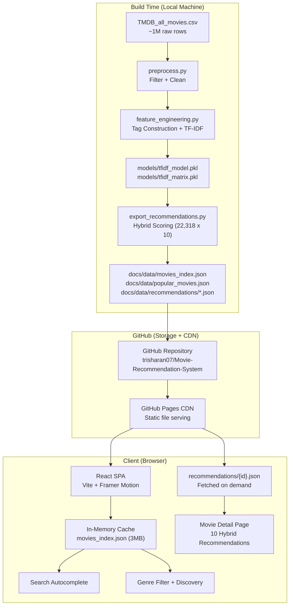
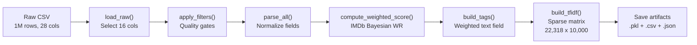
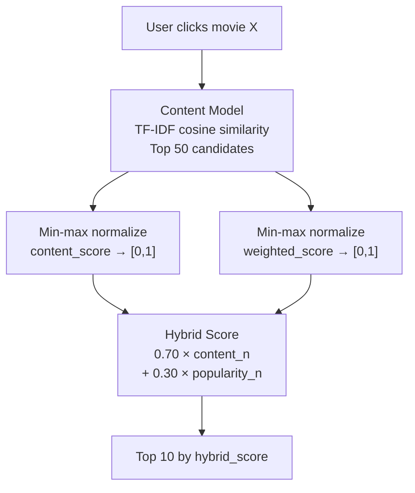
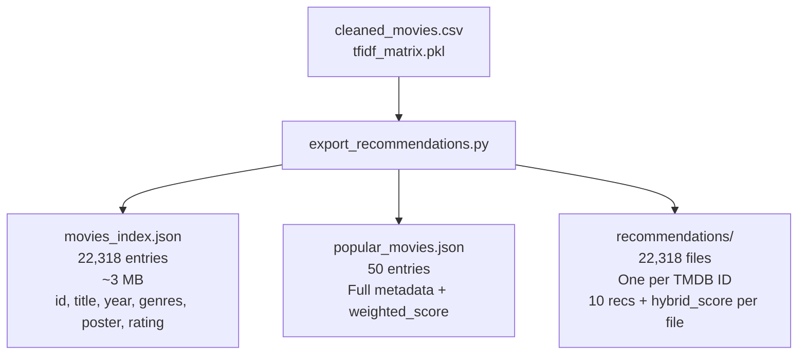
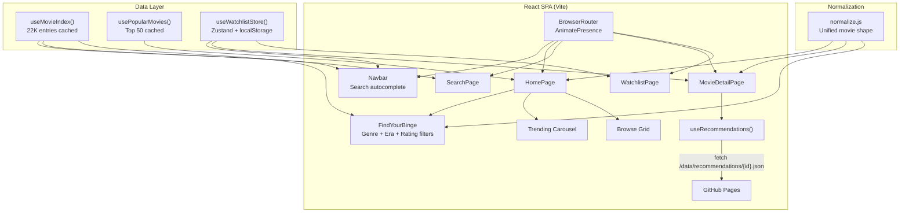
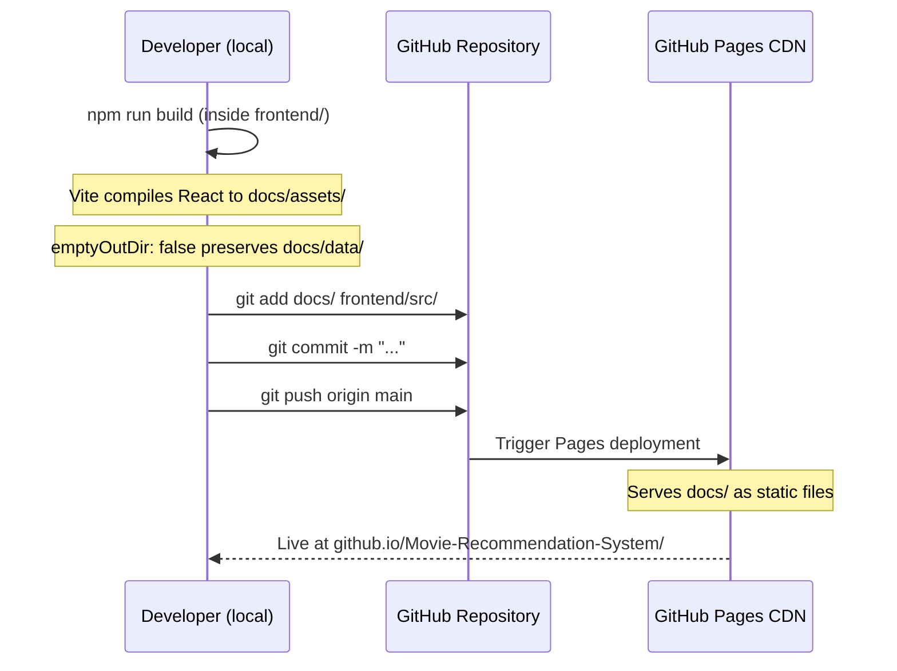

# Binged — Movie Recommendation System

A full-stack movie recommendation system built on the TMDB dataset. The backend is a Python offline pipeline that applies content-based filtering via TF-IDF cosine similarity and an IMDb-style Bayesian popularity score, blended into a hybrid ranking. All recommendations are precomputed at build time and exported as static JSON files. The frontend is a React single-page application deployed to GitHub Pages that consumes those static files with no server required at runtime.

**Live site:** https://trisharan07.github.io/Movie-Recommendation-System/

---

## Table of Contents

1. [Project Overview](#project-overview)
2. [System Architecture](#system-architecture)
3. [Backend Pipeline](#backend-pipeline)
   - [Data Pipeline](#data-pipeline)
   - [Recommendation Models](#recommendation-models)
   - [Export Pipeline](#export-pipeline)
4. [Data Schema](#data-schema)
5. [Frontend Architecture](#frontend-architecture)
6. [Technology Stack](#technology-stack)
7. [Repository Structure](#repository-structure)
8. [Local Development Setup](#local-development-setup)
9. [Deployment](#deployment)
10. [Testing](#testing)
11. [Performance Characteristics](#performance-characteristics)
12. [Design Decisions](#design-decisions)

---

## Project Overview

The system solves a common problem in recommendation systems: how to deliver low-latency, high-quality recommendations without running a live inference server. The approach used here is **build-time precomputation** — all recommendations are computed once, serialized to JSON, and served as static files via GitHub Pages CDN. This makes the runtime stack entirely serverless.

The dataset is a TMDB (The Movie Database) snapshot containing approximately 1 million raw entries. After quality filtering, 22,318 movies remain in the index, each with 10 precomputed hybrid recommendations.

Key capabilities delivered:

- Full-text search across 22,318 movies with sub-200ms autocomplete latency
- Hero section with the top 50 movies ranked by IMDb Bayesian weighted score
- Per-movie detail page with 10 hybrid recommendations and normalized match scores
- Genre-based discovery ("Find Your Next Binge") with live client-side filtering
- Persistent watchlist stored in `localStorage`
- Zero backend infrastructure at runtime

---

## System Architecture



---

## Backend Pipeline

### Data Pipeline

The pipeline runs in five sequential stages driven by `scripts/build_models.py`.



**Stage 1 — Load (`preprocess.load_raw`)**

Reads only 16 of the 28 columns to minimize memory usage. Columns loaded: `id`, `title`, `overview`, `genres`, `cast`, `director`, `vote_average`, `vote_count`, `popularity`, `release_date`, `poster_path`, `status`, `imdb_rating`, `runtime`, `original_language`, `imdb_votes`.

**Stage 2 — Filter (`preprocess.apply_filters`)**

Four quality gates are applied in order:

| Filter | Condition | Purpose |
|--------|-----------|---------|
| Missing fields | Drop rows with null `title` or `overview` | Remove incomplete entries |
| Stub overviews | Drop overviews shorter than 30 characters | Remove placeholder descriptions |
| Vote threshold | Keep `vote_count >= 100` (configurable) | Remove obscure films with no community signal |
| Release status | Keep `status == "Released"` | Remove pre-release and cancelled titles |

After filtering, approximately 22,318 movies remain from the original ~1M rows.

**Stage 3 — Parse (`preprocess.parse_all`)**

Normalizes all text fields:

- `genres_list` — comma-separated genre string split into a list; spaces removed and lowercased (e.g., `"Science Fiction"` becomes `sciencefiction`)
- `cast_list` — top 5 cast members, lowercased, spaces removed
- `director_list` — director names, lowercased, spaces removed
- `overview_clean` — lowercase, HTML stripped, non-alphabetic characters removed

**Stage 4 — Bayesian Score (`preprocess.compute_weighted_score`)**

Implements the IMDb Bayesian Weighted Rating formula:

```
WR = (v / (v + m)) * R + (m / (v + m)) * C

Where:
  v = vote_count for the film
  m = 80th percentile vote_count across the dataset (minimum vote threshold)
  R = vote_average for the film
  C = mean vote_average across the entire dataset
```

This penalizes films with very few votes by pulling their scores toward the global mean. A film with 50 votes and 9.0 average will score lower than a film with 10,000 votes and 8.2 average.

**Stage 5 — Feature Engineering (`feature_engineering`)**

Constructs a single weighted text field per movie by token repetition:

```
Tags = (director × 3) + (genres × 2) + (cast × 1) + overview
```

Director tokens are repeated three times because director style is the strongest content signal — two Christopher Nolan films are more similar than two generic action films. Genre tokens are repeated twice as a secondary categorical signal. Cast and overview are weighted at one.

The `TfidfVectorizer` is configured as follows:

| Parameter | Value | Rationale |
|-----------|-------|-----------|
| `max_features` | 10,000 | Sufficient vocabulary for genre, director, cast tokens |
| `ngram_range` | (1, 1) | Unigrams only; tokens are already compound (`sciencefiction`) |
| `min_df` | 2 | Ignore terms appearing in only one movie |
| `sublinear_tf` | True | Apply `log(1 + tf)` to dampen excess weight from repeated director tokens |
| `stop_words` | english | Remove common words that add noise |

Output: a sparse matrix of shape `(22318, 10000)`.

---

### Recommendation Models

Three models are implemented in `src/models.py`:



**Model 1: Content-Based Filtering**

Uses `sklearn.metrics.pairwise.linear_kernel` rather than `cosine_similarity`. Since `TfidfVectorizer` already returns L2-normalized rows, the dot product equals cosine similarity and is approximately 2x faster.

```python
scores = linear_kernel(tfidf_matrix[movie_idx], tfidf_matrix).flatten()
```

**Model 2: Popularity Ranking**

Returns movies ranked by `weighted_score` with optional genre and year range filters. Used for the homepage hero section and the "Trending Now" carousel.

**Model 3: Hybrid Recommendation**

The hybrid model blends content and popularity signals in two steps:

1. Retrieve the top 50 content-similar candidates
2. Min-max normalize both `content_score` and `weighted_score` independently to the range `[0, 1]`
3. Compute: `hybrid_score = 0.70 × content_n + 0.30 × popularity_n`
4. Return top 10 by `hybrid_score`

The 70/30 split reflects the primary intent: the user clicked on a specific movie, so content similarity is the dominant signal. Popularity acts as a quality tiebreaker between equally similar candidates.

---

### Export Pipeline

`scripts/export_recommendations.py` runs after `build_models.py` and produces three types of static files:



**`movies_index.json`**

Loaded once into browser memory on first visit. Used for search autocomplete across all 22,318 movies. Kept minimal to reduce payload size.

**`popular_movies.json`**

Top 50 movies by Bayesian weighted score. Used for the homepage hero carousel and trending section.

**`recommendations/{tmdb_id}.json`**

Fetched on demand when a user navigates to a movie detail page. Contains the query movie's ID and title, plus an array of 10 recommendation objects each with their `hybrid_score`.

---

## Data Schema

### `movies_index.json` entry

```json
{
  "id": "278",
  "title": "The Shawshank Redemption",
  "year": 1994,
  "genres": "Drama, Crime",
  "poster": "/q6y0Go1tsGEsmtFryDOJo3dEmqu.jpg",
  "rating": 8.7
}
```

### `popular_movies.json` entry

```json
{
  "id": "278",
  "title": "The Shawshank Redemption",
  "genres": "Drama, Crime",
  "vote_average": 8.7,
  "vote_count": 26000,
  "release_year": 1994,
  "poster_path": "/q6y0Go1tsGEsmtFryDOJo3dEmqu.jpg",
  "weighted_score": 8.652,
  "director": "Frank Darabont"
}
```

### `recommendations/{id}.json`

```json
{
  "query_id": "278",
  "query_title": "The Shawshank Redemption",
  "recommendations": [
    {
      "id": "372058",
      "title": "Your Name.",
      "year": 2016,
      "genres": "Animation, Romance, Drama",
      "poster": "/q719jXXEzOoYaps6babgKnONONX.jpg",
      "rating": 8.4,
      "overview": "High schoolers Mitsuha and Taki...",
      "hybrid_score": 0.8341,
      "director": "Makoto Shinkai"
    }
  ]
}
```

---

## Frontend Architecture



**Component Hierarchy**

```
App.jsx
├── Navbar.jsx
│   └── Search autocomplete dropdown
├── HomePage.jsx
│   ├── Hero section (backdrop + stagger animation)
│   ├── FindYourBinge.jsx
│   │   └── MovieCard.jsx (results row)
│   ├── Trending carousel
│   │   └── MovieCard.jsx
│   └── MovieGrid.jsx
│       └── MovieCard.jsx
├── SearchPage.jsx
│   └── MovieGrid.jsx
├── MovieDetailPage.jsx
│   └── MovieCard.jsx (recommendations)
└── WatchlistPage.jsx
    └── MovieGrid.jsx
```

**State Management**

State is divided into three layers:

| Layer | Tool | Scope |
|-------|------|-------|
| Server state (JSON files) | Custom hooks + `fetch` + in-memory `Map` cache | Session-level cache, no re-fetching |
| Global UI state | Zustand | Watchlist persisted to `localStorage` |
| Local UI state | React `useState` | Component-level (hover, focus, carousel index) |

**Data Normalization**

The three JSON data sources use inconsistent field names. `src/lib/normalize.js` maps every raw object to a single canonical shape:

| Canonical field | `movies_index.json` source | `popular_movies.json` source | `recommendations/*.json` source |
|-----------------|---------------------------|-----------------------------|---------------------------------|
| `id` | `id` | `id` | `id` |
| `year` | `year` | `release_year` | `year` |
| `poster` | `poster` | `poster_path` | `poster` |
| `rating` | `rating` | `vote_average` | `rating` |
| `genreList` | parsed from `genres` | parsed from `genres` | parsed from `genres` |

---

## Technology Stack

### Backend

| Component | Technology |
|-----------|------------|
| Language | Python 3.10+ |
| Data processing | pandas 2.0, numpy 1.24 |
| Vectorization | scikit-learn 1.3 (`TfidfVectorizer`) |
| Similarity | scikit-learn (`linear_kernel`) |
| Serialization | joblib 1.3 |
| Progress reporting | tqdm 4.65 |
| Testing | pytest 7.4 |

### Frontend

| Component | Technology |
|-----------|------------|
| Framework | React 18 |
| Build tool | Vite 5 |
| Routing | React Router v7 |
| Animation | Framer Motion 12 |
| State management | Zustand 5 |
| Styling | Tailwind CSS v3 |
| Icons | Lucide React |
| Type merging | clsx + tailwind-merge |

### Infrastructure

| Component | Technology |
|-----------|------------|
| Hosting | GitHub Pages (static) |
| CDN | GitHub Pages global CDN |
| Storage | Git LFS not required — JSON files are plain text |
| CI/CD | Manual (`npm run build` + `git push`) |

---

## Repository Structure

```
.
├── docs/                          # Built React app — served by GitHub Pages
│   ├── index.html
│   ├── assets/
│   │   ├── index-*.js             # Compiled React bundle (~430 KB)
│   │   └── index-*.css            # Compiled styles (~26 KB)
│   ├── favicon.svg
│   └── data/
│       ├── movies_index.json      # 22,318 entries for search (~3 MB)
│       ├── popular_movies.json    # Top 50 movies
│       └── recommendations/
│           ├── 278.json           # {id}.json — one per movie
│           └── ...                # 22,318 total files
│
├── frontend/                      # React source code
│   ├── src/
│   │   ├── App.jsx                # Router + AnimatePresence
│   │   ├── main.jsx               # React entry point
│   │   ├── index.css              # Tailwind directives + global styles
│   │   ├── components/
│   │   │   ├── Navbar.jsx         # Search autocomplete, watchlist badge
│   │   │   ├── MovieCard.jsx      # 3D tilt, watchlist toggle
│   │   │   ├── MovieGrid.jsx      # Staggered animated grid
│   │   │   └── FindYourBinge.jsx  # Genre/rating/era filter + results
│   │   ├── pages/
│   │   │   ├── HomePage.jsx       # Hero + carousel + browse
│   │   │   ├── SearchPage.jsx     # Full-text search results
│   │   │   ├── MovieDetailPage.jsx# Metadata + recommendations
│   │   │   └── WatchlistPage.jsx  # Saved movies
│   │   ├── hooks/
│   │   │   ├── useMovieIndex.js   # Load + cache movies_index.json
│   │   │   ├── usePopularMovies.js# Load + cache popular_movies.json
│   │   │   └── useRecommendations.js # Fetch per-movie recommendation file
│   │   ├── lib/
│   │   │   ├── api.js             # Fetch helpers with in-memory cache
│   │   │   ├── normalize.js       # Unify field names across JSON sources
│   │   │   ├── tmdb.js            # TMDB image URL builder
│   │   │   └── utils.js           # cn() class name utility
│   │   └── store/
│   │       └── useWatchlistStore.js # Zustand store with localStorage
│   ├── package.json
│   ├── vite.config.js             # Base path + outDir: ../docs
│   └── tailwind.config.js         # Design tokens (lime accent, dark palette)
│
├── src/                           # Python recommendation engine
│   ├── preprocess.py              # Load, filter, parse, score
│   ├── feature_engineering.py     # Tag construction + TF-IDF
│   ├── models.py                  # Content, popularity, hybrid models
│   └── utils.py                   # Shared helpers
│
├── scripts/
│   ├── build_models.py            # Runs the full preprocessing pipeline
│   └── export_recommendations.py  # Generates all JSON files
│
├── data/
│   ├── raw/                       # Raw TMDB CSV (gitignored, ~700 MB)
│   └── processed/
│       └── cleaned_movies.csv     # 22,318 rows after filtering
│
├── models/
│   ├── model_metadata.json        # Build info (committed)
│   ├── tfidf_model.pkl            # Fitted vectorizer (gitignored)
│   └── tfidf_matrix.pkl           # Sparse matrix (gitignored)
│
├── tests/
│   └── test_models.py
│
├── requirements.txt
└── .gitignore
```

---

## Local Development Setup

### Prerequisites

- Python 3.10 or higher
- Node.js 20.19 or higher (or 22.12+)
- npm 9+
- The TMDB dataset CSV placed at `data/raw/TMDB_all_movies.csv`

### Backend Setup (one-time, required to rebuild data)

```bash
# Create and activate virtual environment
python -m venv venv
venv\Scripts\activate          # Windows
source venv/bin/activate       # macOS / Linux

# Install Python dependencies
pip install -r requirements.txt

# Step 1: Preprocess the raw dataset and train the TF-IDF model (~5-10 min)
python scripts/build_models.py

# Step 2: Export all 22,318 recommendation JSON files (~10-15 min)
python scripts/export_recommendations.py

# Optional: export only the top 5,000 movies (faster for testing)
python scripts/export_recommendations.py --top 5000
```

The `build_models.py` script accepts one optional argument:

| Argument | Default | Description |
|----------|---------|-------------|
| `--vote-threshold` | 100 | Minimum `vote_count` to include a movie |

The `export_recommendations.py` script accepts:

| Argument | Default | Description |
|----------|---------|-------------|
| `--top` | None (all) | Limit export to top N movies by weighted score |
| `--pool` | 50 | Candidate pool size for hybrid model |
| `--top-n` | 10 | Number of recommendations per movie |

### Frontend Setup

```bash
cd frontend
npm install
npm run dev
# Development server: http://localhost:5173/Movie-Recommendation-System/
```

The development server proxies nothing — all data fetches go to the live GitHub Pages URL. The `movies_index.json` and recommendation files are loaded from `https://trisharan07.github.io/Movie-Recommendation-System/data/` even in local development.

---

## Deployment

The deployment workflow is entirely manual. There is no CI/CD pipeline.



**Important:** The Vite config sets `emptyOutDir: false` to prevent the build process from deleting the 22,318 recommendation JSON files in `docs/data/` on each rebuild. Only the `index.html` and `assets/` files are overwritten.

**GitHub Pages Configuration:**

- Repository Settings > Pages
- Source: Deploy from branch `main`
- Folder: `/docs`

---

## Testing

Run the test suite from the project root:

```bash
# Activate virtual environment first
venv\Scripts\activate

pytest tests/ -v
```

`tests/test_models.py` covers:

- `preprocess.apply_filters` — verifies all quality gates remove the correct rows
- `preprocess.compute_weighted_score` — asserts Bayesian formula output is within `[0, 10]`
- `models.get_similar_movies` — asserts shape and that the query movie is excluded from its own results
- `models.get_popular_movies` — asserts ordering and optional genre filter
- `models.get_hybrid_recommendations` — asserts `hybrid_score` is within `[0, 1]` and that results are top-N

---

## Performance Characteristics

### Backend (build time)

| Operation | Time | Notes |
|-----------|------|-------|
| `build_models.py` full run | 5-10 min | Dominated by 1M-row CSV parse |
| TF-IDF fit + transform | ~60s | 22,318 docs × 10,000 features |
| `export_recommendations.py` (all) | 10-15 min | 22,318 × `linear_kernel` calls |

### Frontend (runtime)

| Operation | Latency | Notes |
|-----------|---------|-------|
| Initial page load | ~1-2s | React bundle + fonts |
| `movies_index.json` load | ~300-800ms | 3 MB JSON, cached after first load |
| Search autocomplete | <200ms | In-memory filter after index loads |
| Recommendation fetch | ~100-300ms | ~2 KB per file, GitHub CDN |
| "Find Your Next Binge" filter | <50ms | Synchronous client-side filter |

---
